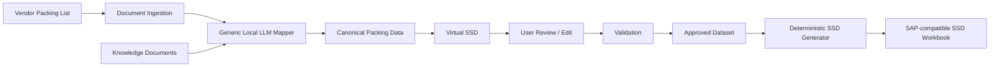

# PackBridge Product Vision

## Purpose

PackBridge converts packing-list information from internal and external vendors into a reviewed, editable working dataset and then generates the SSD workbook required for downstream SAP import.

The problem is not simply "copy data from one document into another." Packing lists can vary significantly between vendors and document families. The application therefore needs to understand supplier terminology and layout, normalise the information, let a user verify or correct it, and only then create the controlled SSD output.

## Product objective

Create a production-capable example of document automation that can run entirely on local infrastructure with a modest local LLM.

The target should demonstrate that a 7B/14B-class model is sufficient for semantic mapping when the rest of the workflow is deliberately deterministic.

## Core workflow

## Product principles

1. **Every packing list goes through the generic mapper.** Internal-vendor documents must not be given a special hard-coded path merely because their current format is familiar.
2. **The LLM interprets; application code controls.** The model maps business meaning. Python performs validation, calculations, persistence and workbook generation.
3. **The source document remains evidence.** A user may change extracted values, but the original extracted/source value is retained.
4. **The Virtual SSD is the working truth.** It combines extracted values, project/master data, calculated values and approved user corrections.
5. **The final SSD is deterministic.** The LLM must never be allowed to add columns, alter workbook structure, rename sheets, or directly write arbitrary content into the SAP import workbook.
6. **Knowledge is document-driven.** Vendor/document behaviour should be explainable and supportable through readable knowledge documents.
7. **Ambiguity is surfaced, not hidden.** If a mapping is uncertain, PackBridge should ask for help or mark the field for review.
8. **Simple success path.** If the document maps correctly, the user should not need to chat with the LLM or inspect technical extraction details.

## Initial proof of concept

The initial reference input is a multi-page packing list where a package is identified by its case number and some cases continue onto later pages. The reference output is the existing SSD workbook used for SAP import.

The POC should prove the following end-to-end path:

- upload packing list;
- extract text/tables;
- run generic local mapping;
- detect/group cases correctly across pages;
- show cases in a Virtual SSD;
- allow user edits;
- validate the working data;
- show source evidence;
- generate the SSD using an exact controlled template;
- preserve an audit trail.

## Future scope

PackBridge should be able to expand beyond the first internal document family to external vendors and other packing-list layouts without changing the central application architecture. New behaviour should normally be introduced through knowledge documents, examples and deterministic validation rules rather than vendor-specific code forks.
