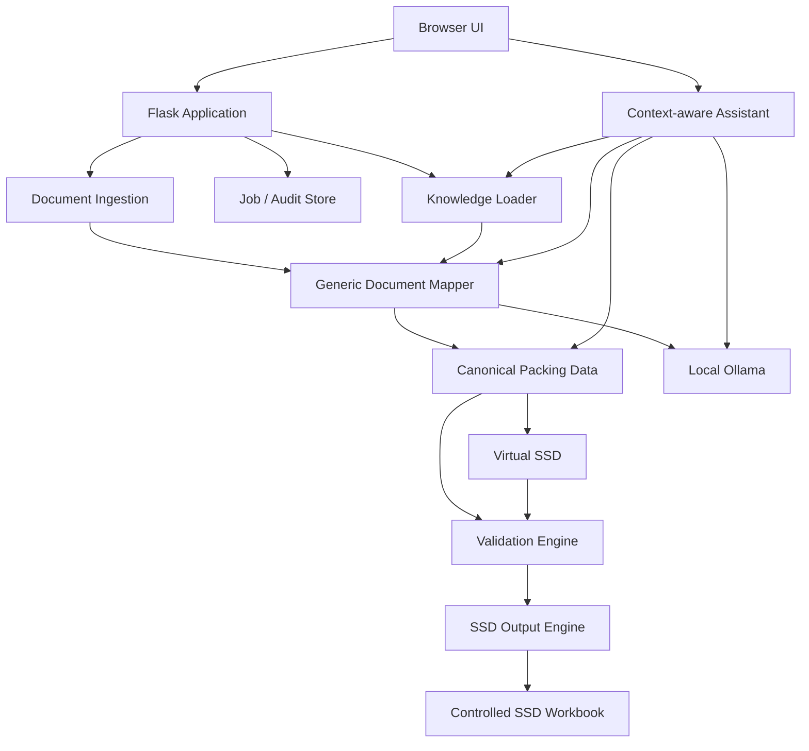

# Architecture

## High-level architecture

PackBridge is a local-first Flask/Python application with a local Ollama LLM.

## Responsibilities

### Document ingestion

Responsible for getting useful content out of source documents without relying on the LLM for file-format mechanics.

Initial supported types should be:

- PDF;
- DOCX;
- XLSX/XLSM as source documents where appropriate;
- text;
- scanned PDF/image through an optional local OCR/vision path.

The ingestion layer should retain:

- original file;
- page numbers;
- extracted text;
- table structure where available;
- page images when needed for visual verification;
- raw extraction evidence.

### Generic document mapper

All packing lists use the same mapper.

Inputs:

- extracted source content;
- canonical schema;
- relevant system knowledge;
- vendor/document-profile knowledge if available;
- approved examples;
- mapping task instructions.

Output:

- structured canonical JSON;
- evidence/reference information;
- explicit nulls for values that are not present;
- issue markers where the source is ambiguous.

The mapper must not create the final SSD workbook.

### Canonical data layer

Supplier-independent representation of:

- source document identity;
- order/project references;
- packages/cases;
- dimensions;
- weights;
- packaging;
- line items;
- source evidence;
- user corrections;
- calculated/default/master-data values;
- approval status.

### Validation engine

Deterministic rules, for example:

- gross weight should normally be greater than or equal to net weight;
- dimensions require length/width/height where expected;
- case identifiers should be unique at package level;
- continuation pages should be grouped into the same case;
- numeric fields must be numeric;
- UOM values must be recognised or explicitly reviewed;
- required SSD fields must be present before final generation;
- generated workbook must preserve the required SSD structure.

Validation warnings should not automatically rewrite data.

### Virtual SSD

A browser representation of the data that will be written to the SSD.

The Virtual SSD is editable. The user edits the working value, while the original source value remains available for traceability.

### SSD output engine

Takes only approved structured data.

Responsibilities:

- copy/load the approved SSD template;
- write values only to permitted locations;
- preserve required sheet names, ordering, data types, formulas and formatting;
- avoid macros unless a future requirement explicitly needs them;
- produce the final SAP-compatible workbook;
- run a structural verification pass before release.

### Knowledge loader

Loads human-readable Markdown knowledge documents and any structured configuration blocks within them.

Knowledge files are the maintainable source of mapping guidance. The application may compile/cache them internally, but the generated cache is not the supportable source of truth.

### Context-aware assistant

The right-hand chat panel uses the same local LLM but is scoped to the active job.

It can:

- explain mappings;
- show evidence;
- investigate validation failures;
- answer questions about the current shipment;
- propose data changes;
- propose knowledge changes;
- ask the user targeted questions when processing is ambiguous.

It cannot directly mutate the final SSD. Changes must go through normal application actions and approval.

## Data persistence

SQLite is suitable for the initial implementation.

The database should contain operational history such as:

- jobs;
- source file metadata;
- canonical/working snapshots;
- validation results;
- change history;
- approvals;
- chat history;
- generated output references.

Do not move vendor mapping knowledge into a complex relational configuration model unless there is a strong future reason.

## Deployment

Initial deployment target:

- Ubuntu server;
- Flask/Python service;
- local/network browser access;
- Ollama reachable over configurable local URL;
- SQLite database;
- file-based knowledge directory;
- local document/output storage.

No cloud service should be required for the core workflow.
