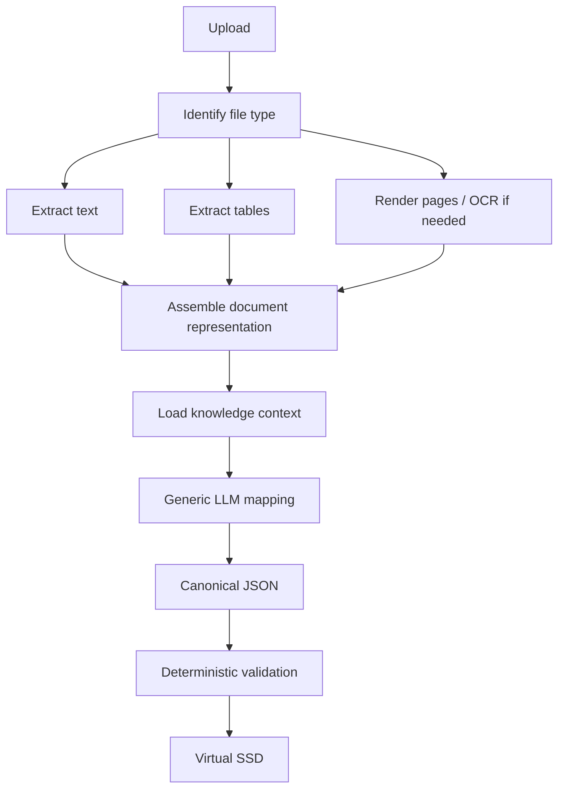

# Document Processing Design

## Goal

Support packing lists from different internal and external vendors without creating a separate coded parser for each vendor layout.

## Pipeline



## File processing

### Digital PDF

Preferred path:

- extract text and page coordinates;
- identify tables/rows;
- retain page boundaries;
- render pages for visual review only when required.

Do not use OCR when reliable embedded text is already available.

### Scanned PDF / images

Optional local path:

- local OCR and/or local vision model;
- preserve page image as evidence;
- record that the value came from OCR/vision rather than embedded text.

### Word/Excel input

Extract structured content while retaining the relationship between headings/tables/sheets and the source.

## No vendor-specific parser path

Even known internal packing lists pass through the generic mapping layer.

Known document profiles are hints, not separate code routes.

The architecture should therefore avoid logic such as:

```python
if vendor == "Hitachi Energy":
    use_he_parser()
```

Instead:

```text
source document
+ canonical schema
+ matching knowledge profile
+ approved examples
→ generic mapper
```

## Document identity and profile matching

A profile may be matched using deterministic indicators such as:

- known headings;
- supplier/vendor name;
- document title;
- common labels;
- stable identifiers;
- layout characteristics.

If no profile matches, process with generic system knowledge and flag the document as a candidate for Learning.

## Multi-page package grouping

Do not equate a page with a package.

The initial reference packing list demonstrates that a case may span multiple PDF pages. Group package sections using package/case identity and continuation context.

The mapper prompt and validation rules must explicitly support continuation pages.

## Chunking strategy

Avoid passing an entire very large document to the LLM if not necessary.

Recommended staged approach:

1. document-level classification and major identifiers;
2. page/section extraction;
3. package/case grouping;
4. per-package field and line-item mapping;
5. merge into one canonical result;
6. whole-document consistency validation.

This allows a modest local model to remain accurate and reduces context usage.

## Extraction output requirements

For every mapped field where practical retain:

- canonical field;
- raw source text;
- parsed value;
- unit;
- source page;
- source section/table row;
- extraction method;
- mapping status.

The model should use explicit `null` when data is absent.

## Mapping status

Prefer operational status labels over invented confidence percentages:

- **CONFIRMED** — explicit source evidence directly supports the mapping.
- **SUPPORTED** — value is clearly derivable from source context.
- **AMBIGUOUS** — more than one interpretation is reasonable.
- **MISSING** — required/expected value not found.
- **INVALID** — mapped value breaks deterministic validation.

## Reprocessing

Allow reprocessing at several levels:

- whole document;
- one case/package;
- one field/section.

Manual working-value changes should not be destroyed without warning when extraction is rerun.
