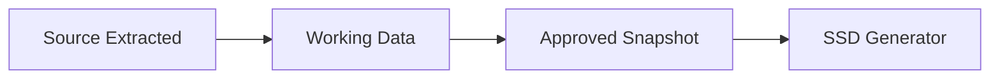

# Canonical Data Model

## Purpose

The canonical data model separates vendor-specific document terminology from the Virtual SSD and final workbook.

All source document formats map into this model.

## Three data states

### Source / extracted state

Represents what PackBridge read from the packing list. It should be retained and treated as evidence.

### Working state

Represents what the user currently wants to use, combining:

- extracted values;
- user corrections;
- project/master data;
- deterministic defaults;
- calculated values.

### Approved state

A working snapshot that has passed review/validation and is authorised for SSD generation.



## Suggested top-level structure

```json
{
  "document": {},
  "order": {},
  "shipment": {},
  "packages": [],
  "issues": [],
  "audit": {}
}
```

## Document

Suggested fields:

- document_type
- vendor
- document_profile
- filename
- document_reference
- document_date
- imported_at
- extraction_method

## Order / project

Potential fields:

- sales_order
- customer_order_number
- order_position
- project
- customer_project
- purchase_order
- purchase_order_position
- project_reference

Some of these may come from project/master data rather than the packing list.

## Shipment

Potential fields:

- product_type
- description
- country_of_origin
- hs_code
- supplier_name
- reference

## Package / case

Suggested structure:

```json
{
  "case_number": "48366831",
  "internal_reference": "SE-...",
  "dimensions": {
    "length": 148,
    "width": 152,
    "height": 66,
    "unit": "CM"
  },
  "volume": {
    "value": 1.485,
    "unit": "M3"
  },
  "gross_weight": {
    "value": 830,
    "unit": "KG"
  },
  "net_weight": {
    "value": 643,
    "unit": "KG"
  },
  "package_type": "CAP-BOX4",
  "package_description": "Box 4",
  "status": "Packed",
  "packed_by": "LW2790",
  "pack_date": "2025-12-03",
  "items": []
}
```

This is illustrative and will be refined once the exact SSD mapping is verified.

## Item

Suggested fields:

- sequence
- position
- item_number
- description
- serial_number
- quantity
- uom
- length
- other fields required by the SSD

## Provenance-aware field representation

Important fields should support both source and working values.

Example:

```json
{
  "gross_weight": {
    "source": {
      "value": 830,
      "unit": "KG",
      "raw": "Gross Weight: 830 KG",
      "page": 1,
      "status": "CONFIRMED"
    },
    "working": {
      "value": 845,
      "unit": "KG",
      "origin": "user_edit"
    },
    "modified": true
  }
}
```

This may be implemented through a common field-value type rather than repeating the structure manually.

## Value origin

Working values should identify origin, for example:

- `source`
- `user_edit`
- `project_data`
- `default_rule`
- `calculated`
- `assistant_proposal_approved`

## Important rule

A user correction must never overwrite the stored source evidence.

The final SSD uses the approved working value, not necessarily the original extracted value.
