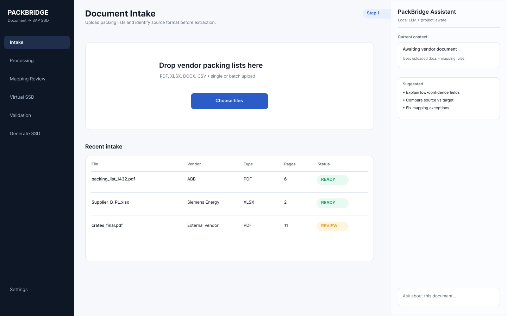
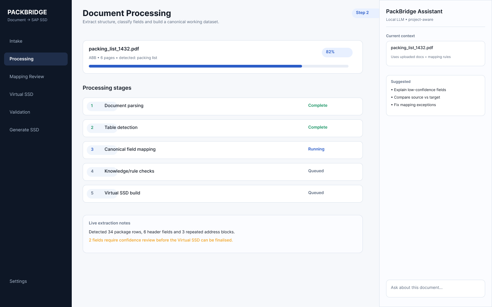
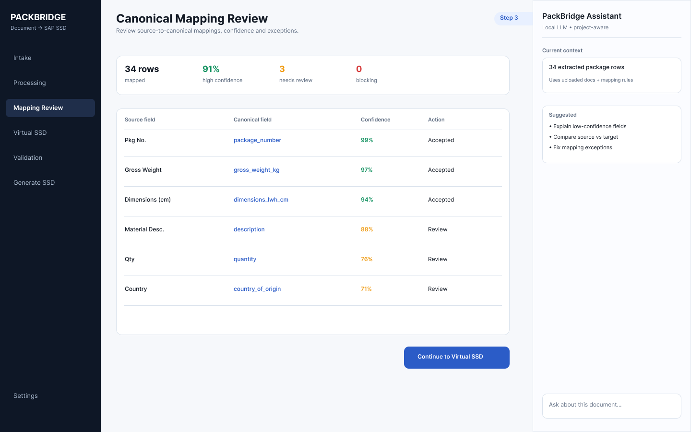
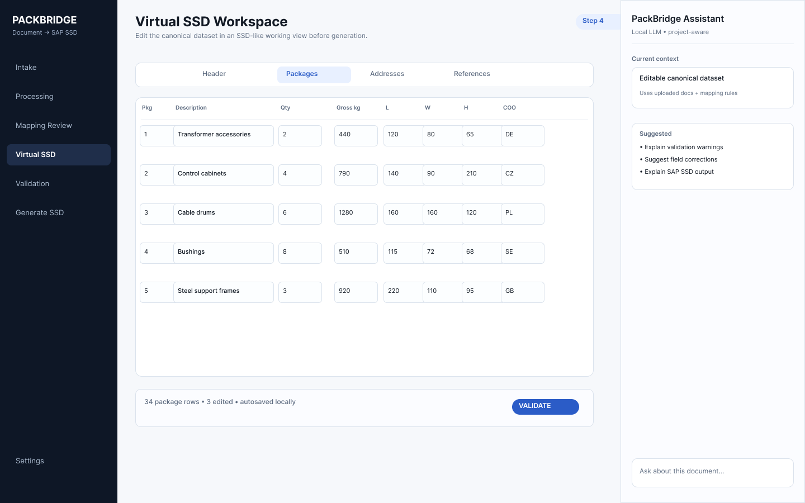
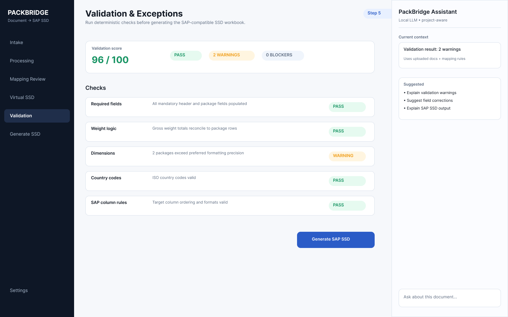
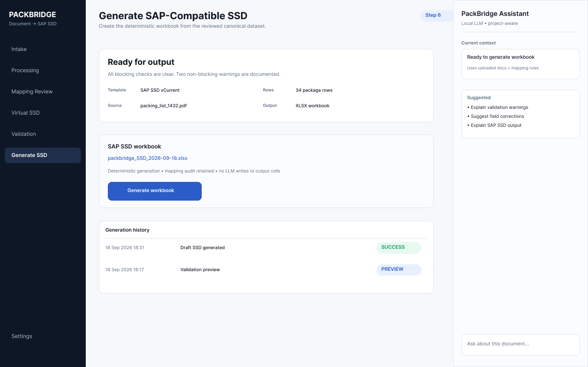

# PackBridge Figma designs

Figma source: https://www.figma.com/design/4brJMCvxkpXySiXmKPga8P

The PNG exports below are generated from the PackBridge application UX file and are intended as the current visual reference for implementation.

## Screens

### 01 — Document Intake

### 02 — Document Processing

### 03 — Canonical Mapping Review

### 04 — Virtual SSD Workspace

### 05 — Validation & Exceptions

### 06 — Generate SAP-Compatible SSD

